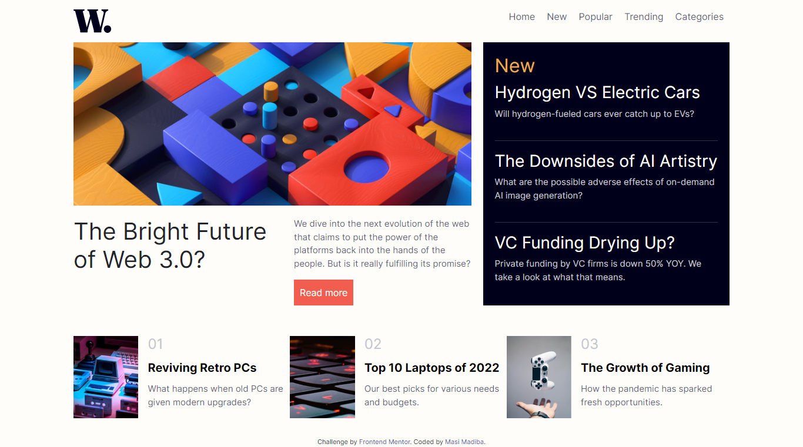

# Frontend Mentor - News homepage solution

This is a solution to the [News homepage challenge on Frontend Mentor](https://masibulele.github.io/news_website/). Frontend Mentor challenges help you improve your coding skills by building realistic projects. 

## Table of contents

- [Overview](#overview)
  - [The challenge](#the-challenge)
  - [Screenshot](#screenshot)
  - [Links](#links)
- [My process](#my-process)
  - [Built with](#built-with)
  - [What I learned](#what-i-learned)
  - [Continued development](#continued-development)
  - [Useful resources](#useful-resources)
- [Author](#author)
- [Acknowledgments](#acknowledgments)

**Note: Delete this note and update the table of contents based on what sections you keep.**

## Overview
front end of a news website

### The challenge

Users should be able to:

- View the optimal layout for the interface depending on their device's screen size
- See hover and focus states for all interactive elements on the page

### Screenshot

### Links

- Solution URL: [Add solution URL here](https://github.com/masibulele/news_website)
- Live Site URL: [Add live site URL here]( https://masibulele.github.io/news_website/)

## My process
download project files
Look at end product
build Html structure
add styling
add funcitionality

### Built with

- Semantic HTML5 markup
- CSS custom properties
- Flexbox
- CSS Grid
- Mobile-first workflow
-Javascript

### What I learned

How to use javascript for the hamburger menu , how to use the grid layout effectively.

### Continued development

Practice how to do different weblayouts

### Useful resources

- [Example resource 1](https://www.w3schools.com/css/) - This helped me with layout reason. 

*
## Author

- Website - [Masibulele Madiba](https://www.your-site.com)
- Frontend Mentor - [@masibulele](https://www.frontendmentor.io/profile/masibulele)

## Acknowledgments

youtube
